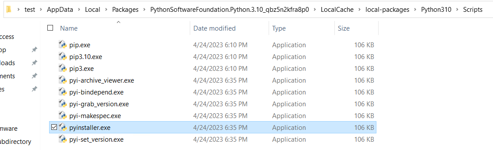
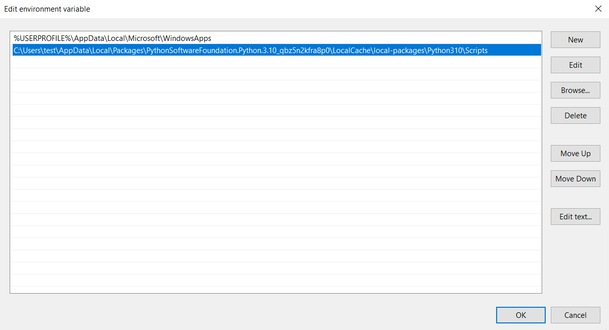
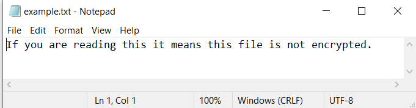
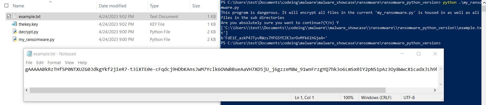
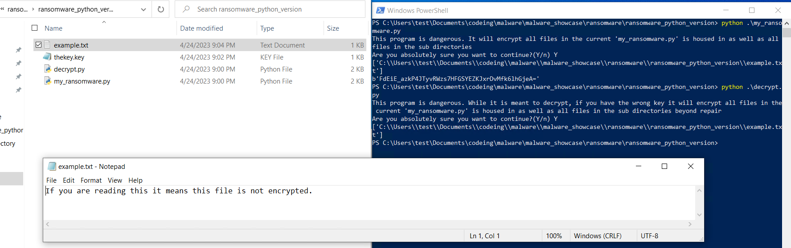

# <h1><b>WARNING</b></h1>
<b>This project is meant for instructional and experimental purposes only. Use of this program without understanding how to use it could lead to permanant loss of important files. This is malware, it does encrypt your files, and unless you decrypt it properly, data will be lost.</b>
# 0. Summary /TLDR
<h3>This is a demonstration of ransomware, built with python. The python code(<a href="https://github.com/williammunnich/ransomware_example/tree/main/ransomware_python_version">available here</a>) was also compiled into exicutable files which are available for testing <a href="https://github.com/williammunnich/ransomware_example/tree/main/ransomware_executable_version/the_executable_files">here</a>. Please be careful as this will encrypt any files where the file is run and any files adjacent or sub-folders.</h3>

# 1. Background
<h3>I was watching Network Chuck's intro to malware making with python: <a href="https://www.youtube.com/watch?v=UtMMjXOlRQc&ab_channel=NetworkChuck">i created malware with Python (it's SCARY easy!!)</a></h3>
<h3>I based my original code off of what I saw in the video and then modified it so it would encrypt all the files in the subdirectory as well. The code uses the python library <a href="https://www.comparitech.com/blog/information-security/what-is-fernet/#:~:text=Fernet%20is%20a%20recipe%20that%20provides%20symmetric%20encryption,a%20range%20of%20different%20use%20cases%20for%20Fernet.">Fernet</a> which is an extension of the python <a href="https://pypi.org/project/cryptography/">cryptography</a> library. Both together allow for AES 128-bit encryption and decryption. After that I turned the two files into fully contained exicutable files using <href="https://pypi.org/project/pyinstaller/" a>pyinstaller</a>, which packages python files along with dependant libraries into a single exicutable file.</h>

# 2. Running and Compiling
I have only tested this code on Windows 10 and I do not know whether the python files would run on other operating systems. 
<h2><b>Python Version</b></h2>
The cryptography library must be instally with: "pip install cryptography". After which, insert <a href="https://github.com/williammunnich/ransomware_example/blob/main/ransomware_python_version/my_ransomware.py">"my_ransomware.py"</a> and <a href="https://github.com/williammunnich/ransomware_example/blob/main/ransomware_python_version/my_ransomware.py">"decrypt.py"</a> in the same file with the file you wish to encrypt. Run "python my_ransomware.py" first, check that the contents of the other files are encrypted. You will see that "thekey.key" was created, you must keep this in the same folder otherwise, the files will not be able to be decrypted. 
To decrypt the files, run "python decrypt.py" in the same folder as the created key file.

<h2><b>Exicutable Version</b></h2>
To compile the the python files in the <a href="https://github.com/williammunnich/ransomware_example/tree/main/ransomware_executable_version/compile_this_python_to_exe">compile_this_python_to_exe</a>, you must download <a href="https://pypi.org/project/pyinstaller/">pyinstaller</a> with "pip install pyinstaller". You then must add it to your path.

You must find the path where the pyinstaller exicutable is.

Afterwards you need to add the path to the exicutable to your path.

You will then package this version of <a href="https://github.com/williammunnich/ransomware_example/blob/main/ransomware_executable_version/compile_this_python_to_exe/my_ransomware.py">my_ransomware.py</a> and <a href="https://github.com/williammunnich/ransomware_example/blob/main/ransomware_executable_version/compile_this_python_to_exe/decrypt.py">decrypt.py</a>(which are different to the previous versions of the python code by a few lines) with the commands "pyinstaller --onefile .\my_ransomware.py" and "pyinstaller --onefile .\my_ransomware.py" respectively. 
After which you can run the two exicutable in the the folder you wish to encrypt. 

# 3. Screenshots

Before encryption.

After being encrypted.

After being decrypted

 

